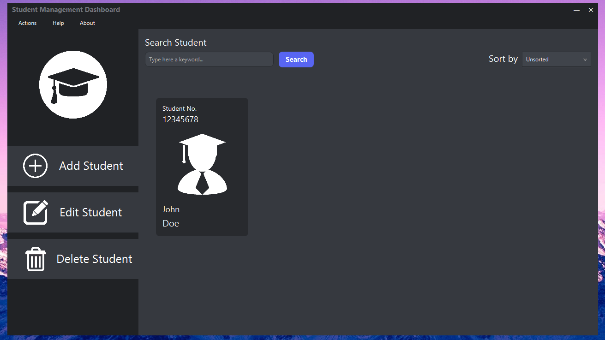
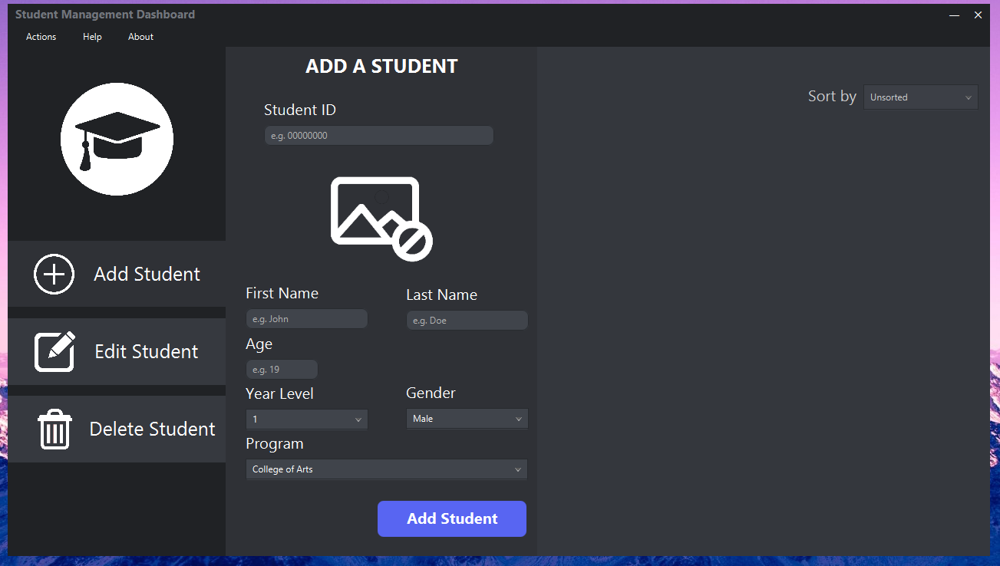
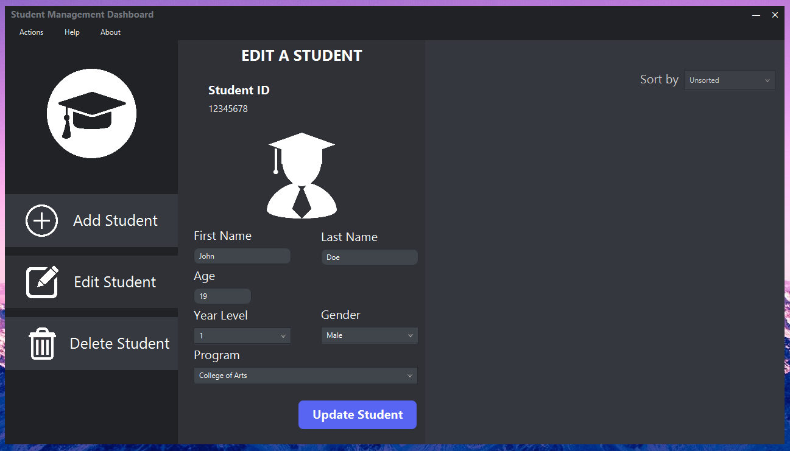
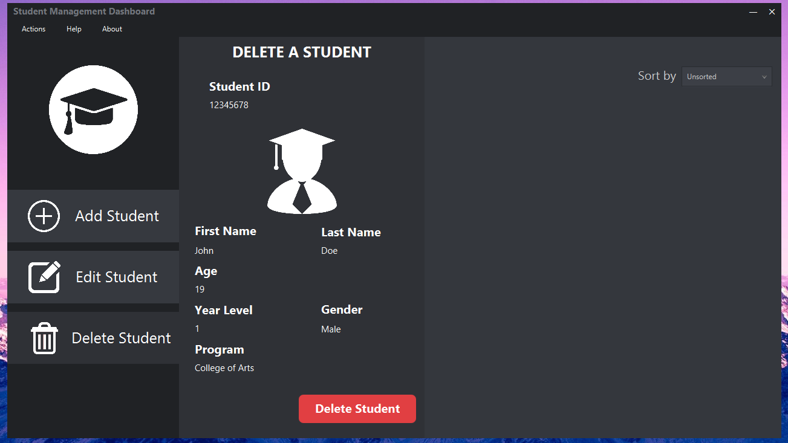
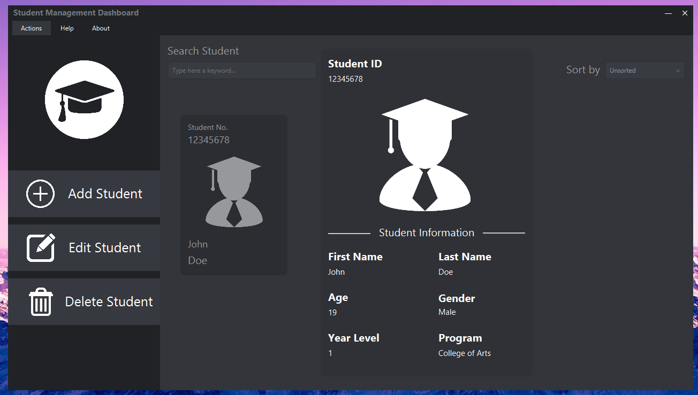

# Student Management Dashboard
This is my group's final project to one of our courses on Object-Oriented Programming, utilizing JavaFX to create a GUI. Everything in this project is done based on our professor's criteria.

I lead the design and development of the GUI, as well as implemented the algorithm for the search function and adding of data to `database/students-list.txt` which allowed us to get a perfect score for this project.

# Screenshots

