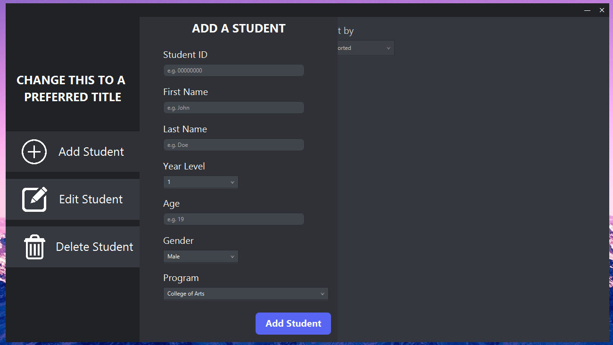
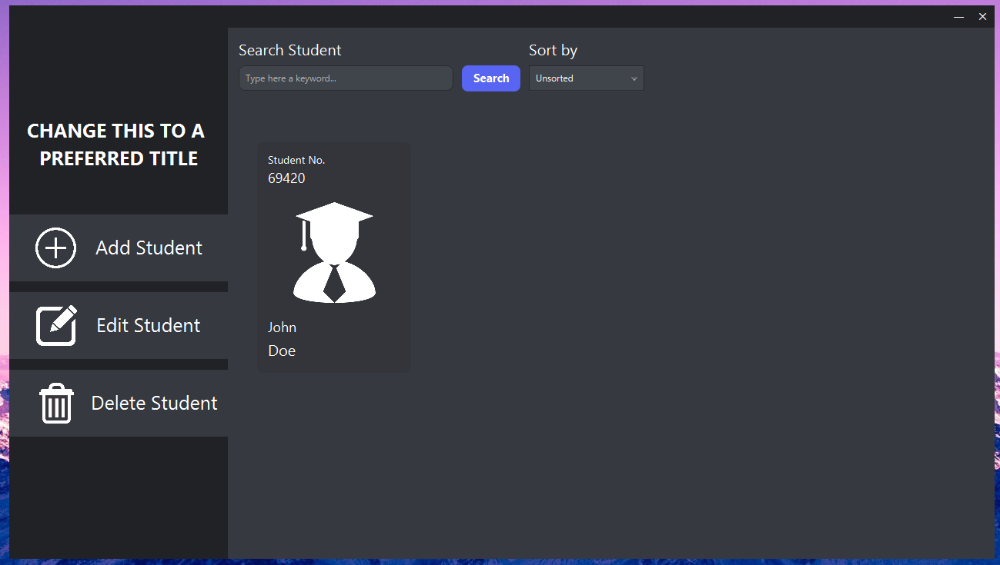
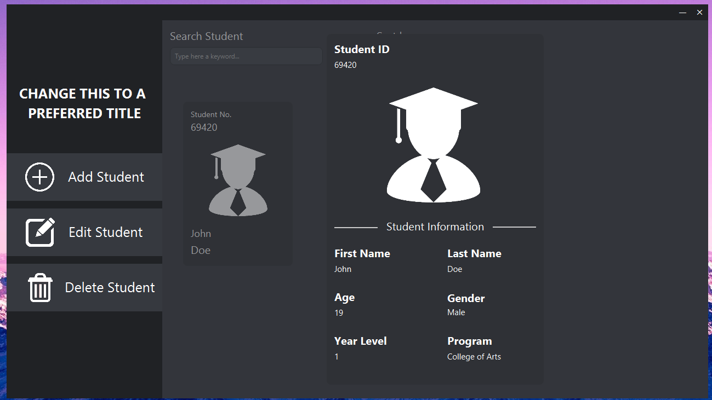
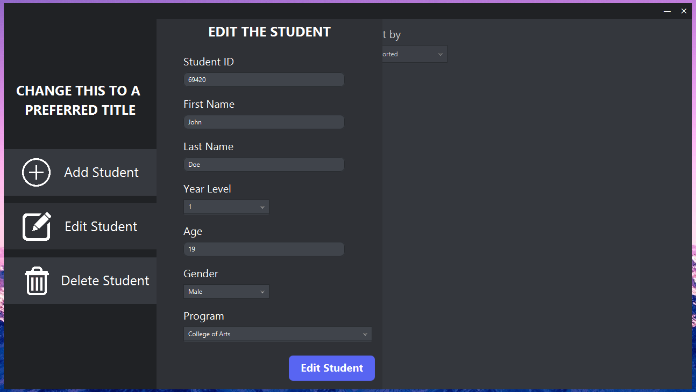
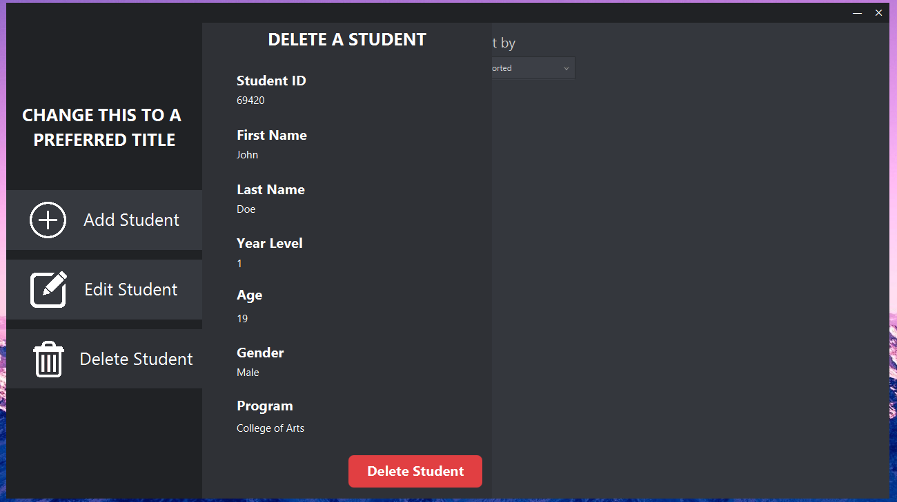

# JavaFX CRUD Project
This is my group's final project to one of our courses on Object-Oriented Programming, utilizing JavaFX to create a GUI. Everything in this project is done based on our professor's criteria.

# Screenshots

